<div align="center">

<picture>
  <source media="(prefers-color-scheme: dark)" srcset="docs/images/banner-dark.png">
  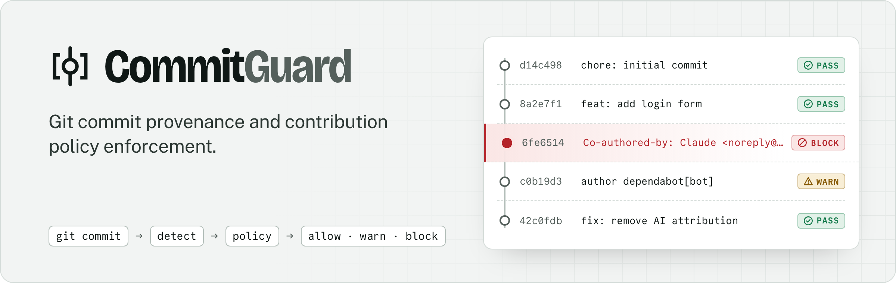
</picture>

<p>
  <a href="https://github.com/oyinlola-tech/commitguard/actions/workflows/ci.yml"></a>
  <a href="https://github.com/oyinlola-tech/commitguard/actions/workflows/security.yml"></a>
  <a href="LICENSE"></a>
  
  
</p>

<p>
  <a href="#see-it-work"><strong>See it work</strong></a> ·
  <a href="#quick-start"><strong>Quick start</strong></a> ·
  <a href="#run-the-demo-locally"><strong>Run the demo</strong></a> ·
  <a href="#test-evidence"><strong>Test evidence</strong></a> ·
  <a href="#documentation"><strong>Docs</strong></a>
</p>

<a href="#built-with"></a>

</div>

<br>

> [!NOTE]
> **Pre-alpha, Phase 8: organization governance and central policy.**
> Local Git hooks stop violations during `git commit` / `git push`; a GitHub
> Actions check and a webhook-driven GitHub App run the same engine on pull
> requests, pushes and merge queues; a web dashboard explains what was scanned,
> what is blocked and why, notifies the people who need to act, and lets an
> organization govern policy across hundreds of repositories: groups,
> approvals, scoped exceptions, staged rollouts and an explicit security posture.

> [!IMPORTANT]
> **A failing GitHub check blocks merges only when branch protection requires it.**
> CommitGuard cannot configure or verify that. See [What works today](#what-works-today).

## See it work

Everything below was produced by running CommitGuard, not typed by hand: the
terminal images come from real commands in a fresh repository, and the dashboard
screenshots come from the demo stack, which replays a full lifecycle through
the real services (see [Run the demo locally](#run-the-demo-locally)).

**1. A local hook stops the commit.** Nothing is committed; the message is kept.

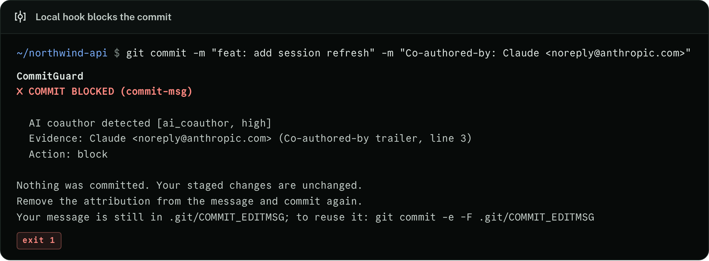

**2. The same engine scans a commit range, as the GitHub check does.** Exit code 1 fails CI.

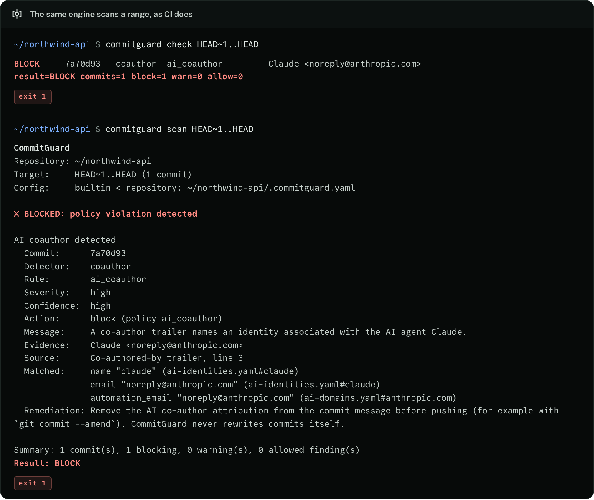

**3. The dashboard explains what was blocked, and why.**

<picture>
  <source media="(prefers-color-scheme: dark)" srcset="docs/images/overview-dark.png">
  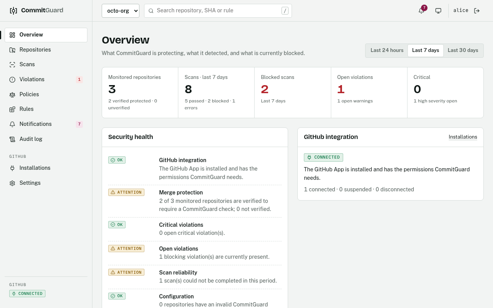
</picture>

<table>
  <tr>
    <td width="50%">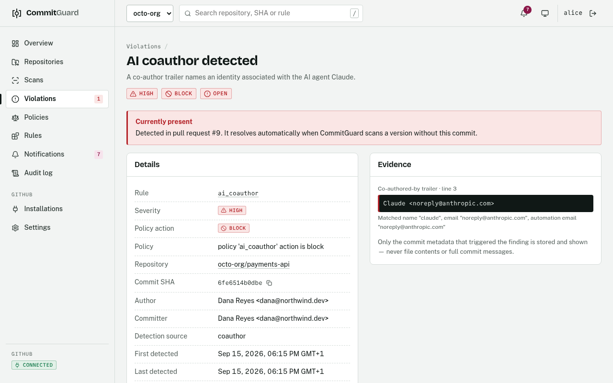<br><sub><b>Violation</b>: the exact trailer, the matched rule data and remediation; never file contents.</sub></td>
    <td width="50%">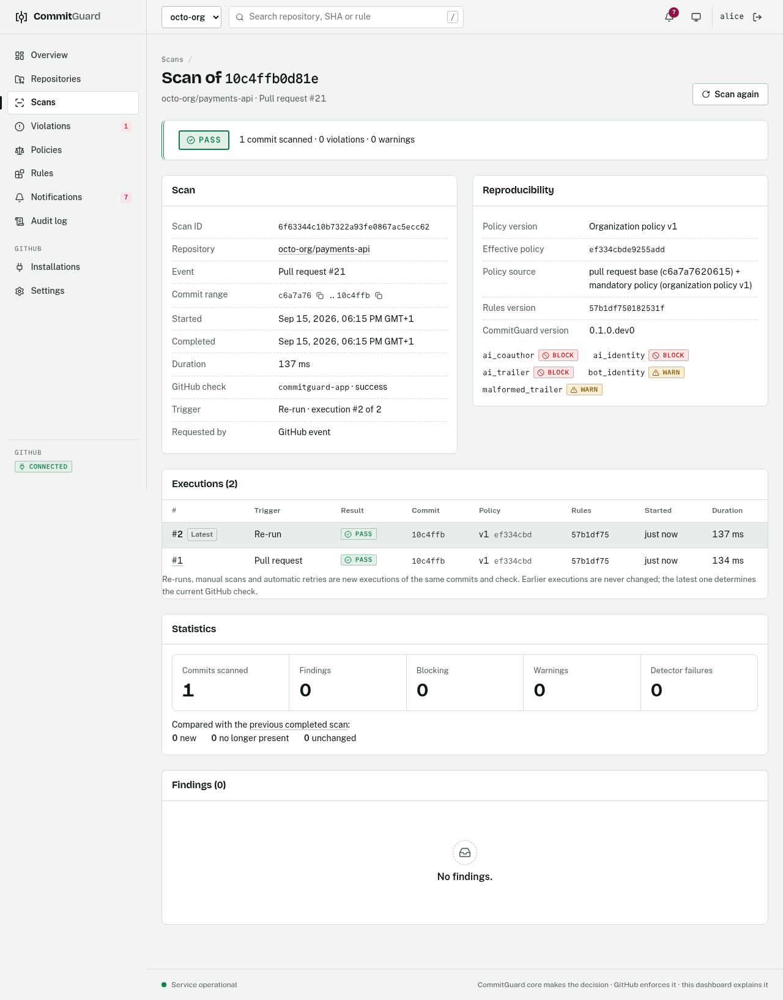<br><sub><b>Re-runs</b>: a GitHub "Re-run" is a numbered execution; earlier results are kept.</sub></td>
  </tr>
  <tr>
    <td>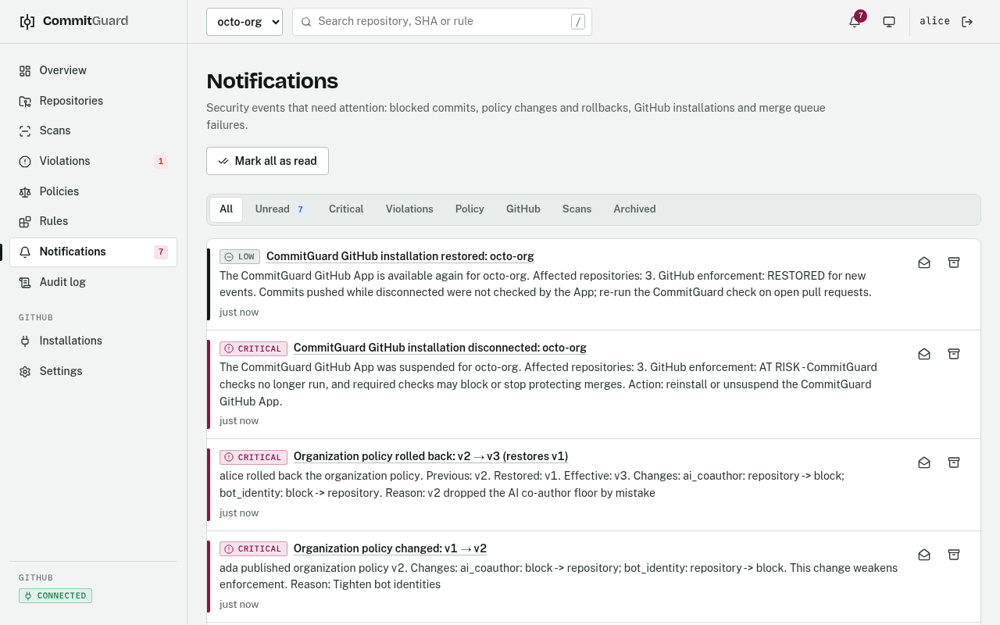<br><sub><b>Notifications</b>: blocked violations, policy changes, rollbacks and installation outages.</sub></td>
    <td>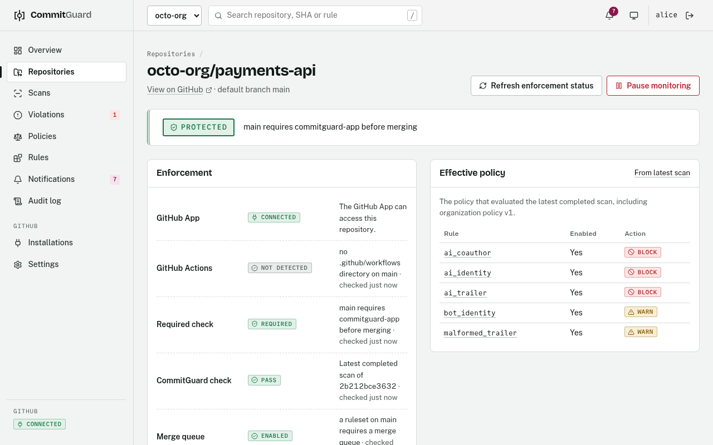<br><sub><b>Repositories</b>: protection is shown only with evidence from GitHub.</sub></td>
  </tr>
  <tr>
    <td>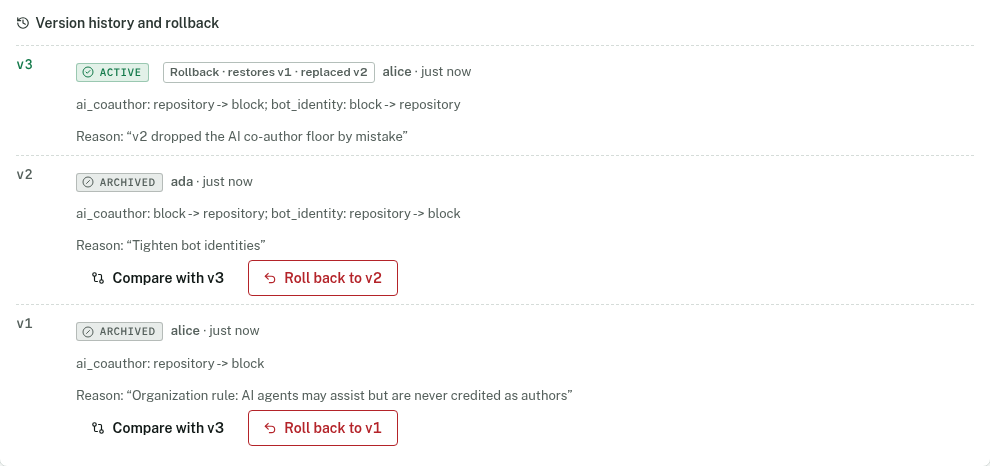<br><sub><b>Policy rollback</b>: immutable versions; a rollback is a new, audited version.</sub></td>
    <td>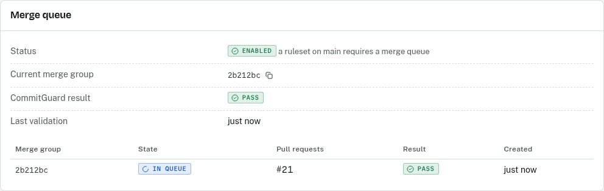<br><sub><b>Merge queue</b>: the merge group commit itself is validated.</sub></td>
  </tr>
</table>

## What CommitGuard is

CommitGuard analyses Git commit metadata and decides, according to a
repository's policy, whether a commit is acceptable. It is built as a general
*provenance and contribution policy engine*: independent detectors report what
a commit claims about its origin, and a separate policy layer decides what to
do about it.

The first policy is **AI agent attribution**. This commit is blocked by default:

```text
feat: implement authentication

Co-authored-by: Claude <noreply@anthropic.com>
```

This one is not:

```text
feat: implement authentication

Co-authored-by: John Doe <john@example.com>
```

## What it detects — and what it does not

CommitGuard detects **explicit attribution and identity evidence** in commit
metadata:

| Rule | Detector | Example | Default |
|---|---|---|---|
| `ai_coauthor` | `coauthor` | `Co-authored-by: Claude <noreply@anthropic.com>` | block |
| `ai_identity` | `identity` | author/committer `Copilot <…+Copilot@users.noreply.github.com>` | block |
| `ai_trailer` | `trailer` | `Generated-by: Claude Code`, `🤖 Generated with [Claude Code](…)` | block |
| `malformed_trailer` | `trailer` | `Co-authored-by Claude noreply@anthropic.com` | warn |
| `bot_identity` | `bot` | author `dependabot[bot]` (a bot, **not** an AI) | warn |

It does **not**:

- determine whether code was written by an AI. A finding means *"this commit
  contains an identity or attribution associated with an AI agent"*, never
  *"this code was written by AI"*;
- guess from wording (`feat: use AI service for recommendations` is not evidence);
- analyse diffs or file contents, call any AI/LLM API, or use the network;
- prove authorship: metadata is self-asserted and can simply be removed.

## Why it exists

AI coding agents increasingly write commits, and many record themselves in
commit metadata. Some organisations and projects need to control that for
licensing or contributor-agreement reasons, accurate provenance records, or a
consistent contribution policy. Checking by hand does not scale, and naive
string matching is both easy to evade (casing, malformed trailers, look-alike
Unicode, escape codes that hide a line) and prone to false positives (a human
named Claude, an employee with an `@anthropic.com` address).

## How AI attribution is identified

```text
Git ─▶ Commit parser ─▶ Commit (author, committer, message, trailers)
                             │
                   Detection engine (4 detectors, pure, offline)
                             │  rules/*.yaml ─▶ identity matcher
                             ▼
                        Findings (rule, severity, confidence, evidence)
                             │
                   Policy evaluator (.commitguard.yaml)
                             ▼
                   Decision: ALLOW / WARN / BLOCK  ─▶ exit code 0 / 0 / 1
```

- **Rules are data** (`rules/ai-identities.yaml`, `ai-domains.yaml`,
  `bot-identities.yaml`, `patterns.yaml`), not code.
- **Matching is deliberate:** exact comparison after case/width/whitespace
  normalisation, removal of invisible characters and folding of Cyrillic/Greek
  look-alikes. No substring or fuzzy matching: `Claude` never matches
  `Claudette` or `Claude Dupont`.
- **Evidence is combined:** an exact AI email, GitHub bot login or distinctive
  name prefix is strong evidence; a bare alias like `Claude` is medium
  confidence; a vendor domain alone (`jane@anthropic.com`) is never enough.
- **Explicit evidence > weak inference.** An agent not listed in the rules is
  not guessed; add a rule instead.

Details: [docs/detection-engine.md](docs/detection-engine.md).

## Detection vs. policy

| | Detector | Policy |
|---|---|---|
| Question | *Does this commit list an AI co-author? What is the evidence?* | *Is that allowed here?* |
| Output | `Finding` (rule, severity, confidence, evidence, remediation) | `Decision` (allow / warn / block, with reasons) |
| Knows about | a single commit and rule data | configuration |
| Side effects | none | none |

Precedence is deterministic: **block > warn > allow**, independent of detector
order. A detector that crashes blocks (fail closed). See
[docs/policy-engine.md](docs/policy-engine.md).

## Quick start

```bash
cd my-project
commitguard init          # .commitguard.yaml with secure defaults
commitguard install       # pre-commit, commit-msg and pre-push hooks
commitguard doctor        # Status: HEALTHY

git add .
git commit -m "implement authentication"   # checked automatically
git push                                   # every outgoing commit checked
```

Server side (GitHub):

```bash
commitguard init --github --action-repository OWNER/commitguard --action-ref <commit sha>
commitguard github setup   # required check name + branch protection steps
```

Then require the `commitguard` status check on protected branches.

## CLI usage

```bash
commitguard init                          # write .commitguard.yaml with secure defaults
commitguard install                       # install hooks (existing hooks are preserved and chained)
commitguard uninstall                     # remove only CommitGuard's hooks, restore previous ones
commitguard scan                          # explain findings for HEAD
commitguard scan origin/main..HEAD        # every commit in a range
commitguard scan --format json            # structured report (schema_version 1)
commitguard check                         # machine-friendly result for HEAD
commitguard check --quiet origin/main..HEAD
commitguard check --message-file .git/COMMIT_EDITMSG   # a commit that does not exist yet
commitguard check --verbose               # check with full human-readable evidence
commitguard policy list                   # effective policies and config layers
commitguard doctor                        # installation, config, engine and hook health
commitguard hook pre-commit|commit-msg <file>|pre-push   # called by installed hooks
commitguard ci github                     # GitHub Actions check (reads $GITHUB_EVENT_PATH)
commitguard github setup                  # workflow status, check name, setup guidance
```

Blocked `scan` output (abridged):

```text
CommitGuard
✗ BLOCKED: policy violation detected

AI coauthor detected
  Commit:      4f71c92
  Detector:    coauthor
  Rule:        ai_coauthor
  Severity:    high
  Confidence:  high
  Action:      block (policy ai_coauthor)
  Evidence:    Claude <noreply@anthropic.com>
  Source:      Co-authored-by trailer, line 4
  Matched:     email "noreply@anthropic.com" (ai-identities.yaml#claude)
  Remediation: Remove the AI co-author attribution from the commit message ...

Result: BLOCK
```

`check` output is one tab-separated line per finding followed by a summary:

```text
BLOCK	4f71c92	coauthor	ai_coauthor	Claude <noreply@anthropic.com>
result=BLOCK commits=1 block=1 warn=0 allow=0
```

### Exit codes

| Code | Meaning |
|---|---|
| `0` | allowed (no findings, or only `allow`/`warn` findings) |
| `1` | blocked by policy (a finding or detector failure evaluated to `block`) |
| `2` | error: invalid configuration/rules, Git error, bad arguments, unexpected failure (hooks block on errors) |

CommitGuard never modifies commits or rewrites history; remediation is always
left to the developer.

## Configuration

```yaml
# .commitguard.yaml
version: 1
policies:
  ai_coauthor:
    enabled: true
    action: block
  bot_identity:
    enabled: true
    action: warn
```

Layers, lowest precedence first: built-in defaults → global
`~/.config/commitguard/config.yaml` → repository `.commitguard.yaml` →
`--config PATH`. Omitted policies keep secure defaults; invalid configuration
is an error (exit 2). Which hooks enforce is set under `enforcement:`
(all enabled by default). See [docs/configuration.md](docs/configuration.md).

## Enforcement layers: local + GitHub

```text
Local Hooks
     │
     ▼
CommitGuard Core  (detection engine · policy engine · ScanService)
     │
     ├───────────────► GitHub Actions      commitguard ci github → job status "commitguard"
     │
     └───────────────► GitHub App          commitguard github serve
                              │
                              ▼
                         Webhooks (signed, deduplicated)
                              │
                              ▼
                         Scan Service (metadata-only fetch, trusted policy)
                              │
                              ▼
                       GitHub Checks       "commitguard-app"
```

In more detail, for the Action:

```text
Developer ─▶ git commit / push ─▶ Local hooks (Phase 3) ──── fast feedback, bypassable
                                        │
                                        ▼
                                     GitHub
                                        │ pull_request / merge_group / push
                                        ▼
                         GitHub Actions: commitguard ci github (Phase 4)
                                        │  same detectors + policy evaluator
                                  ┌─────┴─────┐
                                PASS         FAIL
                                  │            │
                           check passes   check fails ─▶ merge blocked
                                                        (when branch protection
                                                         requires "commitguard")
```

| Layer | Purpose | Can be bypassed by the contributor? |
|---|---|---|
| Local hooks | stop accidents before they leave the machine | yes (`--no-verify`, deleting hooks) |
| GitHub Actions check | server-side validation of every commit a PR introduces | no, but it only *reports* on its own |
| Branch protection / rulesets | make the check a merge requirement | no (repository admins configure it) |

Why both: hooks give immediate feedback without waiting for CI; the GitHub
check makes local bypasses visible and, with branch protection, unmergeable.

**Local hooks** (`commitguard install`): pre-commit checks the pending identity,
commit-msg the message, pre-push every outgoing commit. Existing hooks are
preserved and chained; failures block. See [docs/git-hooks.md](docs/git-hooks.md).

**GitHub check** (`commitguard ci github`, `action.yml`):

- scans every commit a pull request introduces (`head ^base`), not just the
  latest, plus merge queue entries and pushes (new branches, deletions, tags,
  force pushes);
- evaluates with the policy from the **base commit**, so a pull request cannot
  relax `.commitguard.yaml` to approve itself; rules come from the installed
  CommitGuard, never the repository;
- needs only `contents: read`, no secrets, works for fork pull requests;
- fails closed (exit 2) when policy cannot be evaluated;
- a push-triggered run happens **after** commits reach GitHub: prevention needs
  protected branches, required pull requests and the required check.

See [docs/github-enforcement.md](docs/github-enforcement.md).

**GitHub App** (`commitguard github serve`, `pip install 'commitguard[app]'`):

- a centralised service you deploy: install it once on an account or
  organisation and it scans pull requests and pushes of the selected
  repositories from signed webhooks;
- publishes the Check Run `commitguard-app` (queued → in progress → completed)
  on the exact commit it scanned;
- least privilege: Checks write, and read-only Contents, Metadata and Pull
  requests. Tokens are down-scoped to one repository per scan;
- never checks out or runs repository code, and never modifies a repository;
- supports an optional **mandatory policy** that repositories cannot weaken;
- `commitguard github validate` checks configuration, authentication,
  permissions and installations.

Actions or App? Actions: simplest, no service. App: organisation-wide,
webhook-driven, central policy, but you operate it. Both can run together. See
[docs/github-app.md](docs/github-app.md) and [docs/deployment.md](docs/deployment.md).

## Dashboard

```text
CommitGuard core ──► ScanResult ──┬──► CLI (terminal)
                                  ├──► GitHub Check (GitHub enforces it)
                                  └──► /api/v1 ──► Dashboard (explains it)
```

The GitHub App service also serves a web dashboard (`web/`) and its API:

- **Overview** — monitored repositories, scans in a period, blocked scans,
  open and critical violations, explicit security checks (no invented score);
- **Repositories** — protection shown only with evidence from GitHub, and
  separate signals for the App, Actions, required check, latest check and
  local hooks (reported as not verifiable);
- **Scans** — every result with its commit range, findings, evidence and the
  policy, rules and CommitGuard versions that produced it; scan again;
- **Violations** — open, acknowledged or resolved, where resolution happens
  only when the commit is no longer present; remediation guidance; history kept;
- **Policies** — versioned, immutable organization floors that repositories
  cannot lower, with confirmation for weakening changes, a structured diff and
  audited **rollback** to an earlier version; **Rules**; **Audit log**;
  **GitHub installations**;
- **Notifications** — blocked violations, policy changes and rollbacks,
  installation disconnects, merge queue and re-run failures, deduplicated, in
  the dashboard and optionally by e-mail and signed webhooks; **Settings**
  (sessions, members, notification preferences).

- **Organization** — security posture as explicit states with reasons (no
  score), "N of M required repositories satisfy all mandatory controls", a
  repository security matrix, repository groups and bulk onboarding;
  organization, group and repository **policies** with mandatory and default
  strength, drafts, **simulation** against recorded scans, approval with
  separation of duties, **staged rollouts**; scoped, expiring **exceptions**;
  per-rule provenance of the effective policy; organization rules; scheduled
  scans; compliance reports (JSON/CSV, explicitly not a certification).

Sign-in uses the GitHub App's user authorization; roles (viewer, security
manager, admin, owner) are granted in CommitGuard, and users only see
repositories GitHub lets them see. See [docs/dashboard.md](docs/dashboard.md).

## What works today

- `scan`, `check` (including `--message-file`, `--format json`, `--quiet`,
  `--verbose`), `init`, `policy list`, with documented exit codes
- Git hook enforcement: `install`/`uninstall` (per repository, or `--global`
  via a Git template directory), `hook pre-commit|commit-msg|pre-push`,
  chaining of existing hooks, integrity checksums, fail-closed wrappers
- `doctor` with hook presence, integrity, interpreter, enforcement and GitHub
  workflow checks (branch protection is reported as unverifiable)
- GitHub enforcement: `ci github` (pull_request, merge_group, push), trusted
  policy source (base commit), bundled rules only, annotations, job summary,
  step outputs, JSON report; composite `action.yml` with SHA-pinned actions and
  hash-pinned dependencies; `init --github`; `github setup`
- Commit model with parsed trailers; lenient, bounded trailer parser that
  records malformed and evasive variants instead of crashing
- Four detectors (`coauthor`, `identity`, `trailer`, `bot`) driven by YAML rules
- Detector registry, detection engine (fail closed), policy evaluator
- Layered, strictly validated configuration
- Hardened read-only Git access (no shell, `--end-of-options`, no mailmap /
  replace objects, batched reads)
- Terminal-safe output and ASCII-only JSON
- GitHub App service: signed webhooks with replay protection, installation
  lifecycle, repository authorization, down-scoped installation tokens,
  metadata-only Git mirrors, Check Runs with stale-write protection,
  mandatory policy floor, policy-weakening detection, SQLite state with
  retention, audit events, structured logs with correlation IDs,
  `/health` and `/ready`, `github validate`, `github webhook-test`, `github serve`

- Dashboard and `/api/v1`: GitHub sign-in, roles and tenant isolation,
  overview, repositories with enforcement evidence, scans, violations with a
  lifecycle, versioned organization policy, rules, audit log, installations
  and sync, sessions and members; `commitguard dashboard members`
- Notifications: transactional outbox, in-app notification center,
  organization and personal preferences, deduplication, SMTP e-mail and
  HMAC-signed webhooks with bounded retries, delivery records and audit
- GitHub App merge queue validation (`merge_group`), GitHub "Re-run" and
  "Re-run all checks" handling with numbered scan executions, stale re-run
  protection, event processing records with safe redelivery, automatic retry
  of infrastructure failures
- Organization policy rollback (immutable versions, rollback lineage, diff,
  optimistic concurrency, audit and notification in one transaction)
- Organization governance: security settings and baseline, repository
  onboarding (enforce / monitor mode), repository groups, background bulk
  operations, organization/group/repository policies resolved per rule with
  provenance and conflicts, effective policy cache with transactional
  invalidation and propagation status, policy drafts and approvals, emergency
  publication, read-only policy simulation, staged rollouts with automatic
  halt and rollback, scoped expiring exceptions, organization identity rules
  (data only), scheduled default-branch scans, posture, drift, trends, alert
  digests, search and compliance reports

Not yet: PR comments, SARIF, signature verification, secret detection. The App and dashboard have not yet
been tested against github.com itself (only an offline model of the API and
OAuth flow plus real Git).

## Run the demo locally

The demo stack runs the real API, services and dashboard against an offline
model of GitHub, then replays a complete lifecycle: a blocked pull request and
its fix, a GitHub re-run, a merge group, a scan error, a policy change and its
rollback, an App suspension and reconnection, and notification delivery.

```bash
./scripts/install-dev.sh && source .venv/bin/activate
cd web && npm ci && npm run build && cd ..
python tests/e2e/dashboard_harness.py --demo      # http://localhost:4173
```

Open <http://localhost:4173> and choose **Continue with GitHub** (signs in as
the owner, `alice`), or sign in as another role:

| User | Role | Sign-in link |
|---|---|---|
| `alice` | owner | <http://localhost:4173/demo/sign-in?user=501> |
| `ada` | admin | <http://localhost:4173/demo/sign-in?user=504> |
| `sam` | security manager | <http://localhost:4173/demo/sign-in?user=503> |
| `victor` | viewer | <http://localhost:4173/demo/sign-in?user=502> |

The demo keeps its data in a temporary directory, never contacts github.com,
and records e-mail and webhook deliveries in memory instead of sending them.

## Test evidence

<picture>
  <source media="(prefers-color-scheme: dark)" srcset="docs/images/tests-dark.png">
  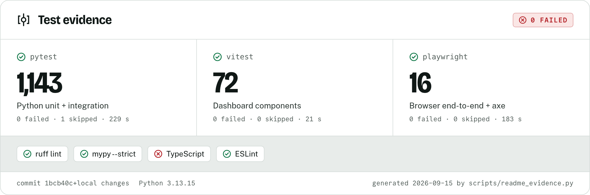
</picture>

The card is rendered from [docs/evidence/tests.json](docs/evidence/tests.json),
which [scripts/readme_evidence.py](scripts/readme_evidence.py) writes from the
real test runs and checks; the live status of every push is the
[CI badge](https://github.com/oyinlola-tech/commitguard/actions/workflows/ci.yml).
To regenerate the evidence, terminal images and screenshots:

```bash
python scripts/readme_evidence.py          # runs all suites and checks, writes docs/evidence/
cd web && npm run build && npm run screenshots   # renders docs/images/
```

## Built with

| | |
|---|---|
| **Core and GitHub App** |      |
| **Dashboard** |     |
| **Quality** |      |

No AI or LLM API is called anywhere: detection is deterministic, offline and
driven by rule data.

## Development

Requires Python 3.12+ and Git 2.31+.

```bash
./scripts/install-dev.sh
source .venv/bin/activate
pytest
ruff check . && ruff format --check .
mypy

# Dashboard (Node.js 20.19+)
cd web && npm ci
npm test && npm run typecheck && npm run lint
npm run build && npm run e2e      # browser tests against the full stack
```

## Roadmap

| Phase | Scope | Status |
|---|---|---|
| **1. Foundation** | project structure · CLI · configuration · Git abstraction · commit model · detector and policy interfaces · testing foundation |  |
| **2. AI attribution detection** | `Co-authored-by` parsing · AI identity and domain rules · identity detection · findings · blocking decisions |  |
| **3. Git enforcement** | `pre-commit` · `commit-msg` · `pre-push` · hook installation and management · local enforcement |  |
| **4. GitHub enforcement** | GitHub Actions check · pull request, merge queue and push scanning · trusted policy source · branch protection guidance |  |
| **5. GitHub App** | webhooks · App authentication · installation lifecycle · Check Runs · ScanService · EnforcementService · audit events · mandatory policy |  |
| **6. Security dashboard and control plane** | GitHub sign-in · roles and tenant isolation · enforcement evidence · scans · violation lifecycle · versioned organization policy · audit log · `/api/v1` |  |
| **7. Notifications, merge queue, re-runs, recovery** | notification outbox · in-app, e-mail and signed webhooks · deduplication and retries · merge group validation · scan executions · policy rollback and diff |  |
| **8. Organization governance** | organization policy hierarchy · repository groups · approvals and separation of duties · policy simulation · staged rollouts · scoped exceptions · security posture · compliance reports |  |
| **Later: security intelligence** | advanced bot detection · signed commit verification · secret detection · provenance analysis · SARIF |  |

## Documentation

- [Architecture](docs/architecture.md)
- [Detection engine](docs/detection-engine.md)
- [Policy engine](docs/policy-engine.md)
- [Configuration](docs/configuration.md)
- [Git hooks](docs/git-hooks.md)
- [GitHub enforcement (Actions)](docs/github-enforcement.md)
- [GitHub App](docs/github-app.md)
- [Dashboard and API](docs/dashboard.md)
- [Notifications](docs/notifications.md)
- [Merge queue](docs/merge-queue.md)
- [Policy management and rollback](docs/policy-management.md)
- [Organization governance](docs/organization-governance.md)
- [Policy inheritance](docs/policy-inheritance.md)
- [Policy simulation](docs/policy-simulation.md)
- [Policy exceptions](docs/policy-exceptions.md)
- [Staged policy rollouts](docs/policy-rollouts.md)
- [Repository management](docs/repository-management.md)
- [Security posture](docs/security-posture.md)
- [Compliance reporting](docs/compliance-reporting.md)
- [Recovery and failure handling](docs/recovery.md)
- [Deployment](docs/deployment.md)
- [Threat model](docs/threat-model.md)

## Contributing, security, license

- [CONTRIBUTING.md](CONTRIBUTING.md)
- [SECURITY.md](SECURITY.md) — please report vulnerabilities and detection bypasses privately
- [CODE_OF_CONDUCT.md](CODE_OF_CONDUCT.md)
- [MIT License](LICENSE)
